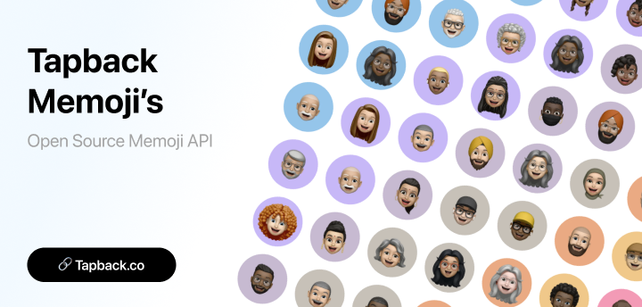

# Tapback Memoji's


[](https://github.com/wimell/Tapback-Memojis/stargazers)

Open source memojis for your apps, designs, and websites. Created by [@wes_wim](https://github.com/wes_wim)

## 🚀 Overview

Tapback Memoji API provides a simple and efficient way to generate unique avatar images for your applications. Whether you need consistent avatars for user profiles or random avatars for placeholder content, our API has got you covered.

## 🔗 Usage

### Get a specific avatar:


```
https://www.tapback.co/api/avatar/{name}.webp
```
Replace `{name}` with any string to generate a unique avatar.

### Get a random avatar:
```
https://www.tapback.co/api/avatar.webp
```

## 🖼️ Example Implementation

HTML:
```html

```

## ✨ Features

- Unique avatars generated based on input string
- Consistent generation for the same input
- No authentication required
- Fast response times
- Suitable for various applications
