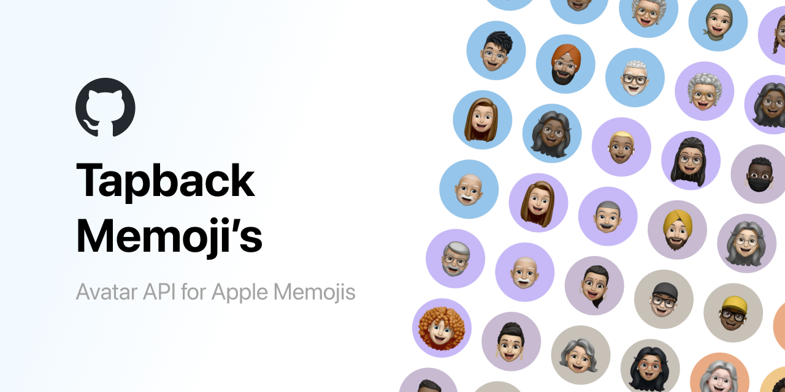

# Tapback Memoji's


[](https://github.com/wimell/Tapback-Memojis/stargazers)


## 🚀 Overview

Tapback Memoji API provides a simple and efficient way to generate unique Apple Memoji style avatars for your applications. Create a random avatar, or generate one based on any string.

Check out the [website](https://www.tapback.co?ref=github-readme) for more information on the API, or install the Laravel app locally via the `src` directory.

Key use cases:
- Dynamic user avatars
- Placeholder avatars
- Figma prototyping


<div style="display: flex; align-items: center; gap: 10px;">
  
  
  
  
</div>

## 🔗 Usage

### Get a specific avatar:


```
https://www.tapback.co/api/avatar/{name}.webp
```
Replace `{name}` with any string to generate a unique avatar.

### Get a random avatar:
```
https://www.tapback.co/api/avatar.webp
```

## 🖼️ Example Implementation

HTML:
```html

```

## ✨ Features

- Unique avatars generated based on input string
- Consistent generation for the same input
- No authentication required
- Fast response times
- Suitable for various applications
